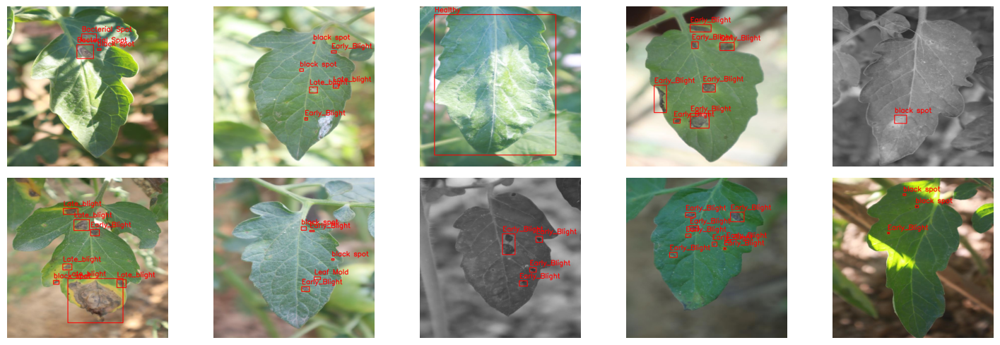
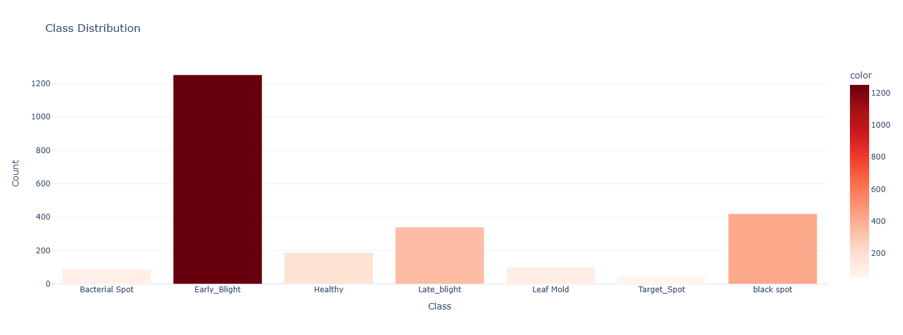
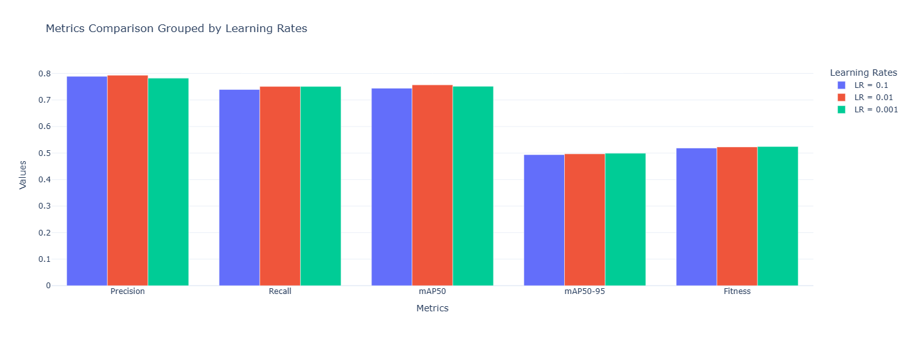
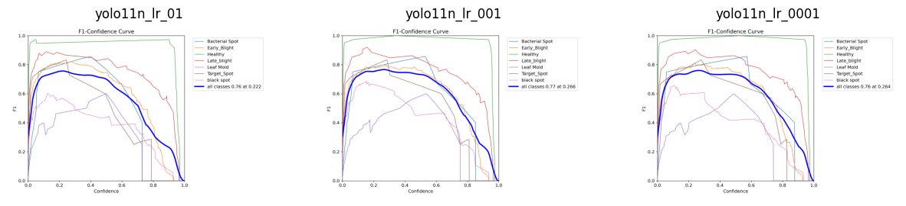
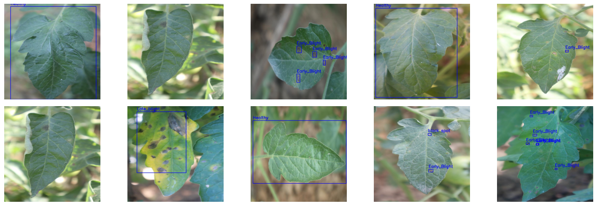

# Tomato Leaf Diseases Detection



## Problem Description
Tomato diseases can significantly impact crop yields and quality, leading to substantial economic losses for farmers. Early detection of leaf diseases is crucial for effective disease management and crop protection. Traditional manual inspection is time-consuming and may not always be accurate. This automated system provides:
- Real-time disease detection
- Accurate classification of multiple disease types
- Visual feedback with annotated images
- Accessible API endpoint for integration into existing agricultural systems

## Project Overview
This project implements a computer vision system for detecting and classifying various diseases in tomato leaves using the YOLO (You Only Look Once) object detection model. The system can identify seven different types of leaf conditions (Bacterial Spot, Early Blight, Late Blight, Leaf Mold, Target Spot, Black Spot, Healthy Leaves).

The solution is deployed as a containerized Flask application that accepts image inputs and returns annotated predictions showing detected diseases.

Evaluation criteria:
- Problem description: 2 points
- EDA (please refer to EDA): 2 points
- Model training (please refer to `experiments/experiments.ipynb`): 3 points
- Exporting notebook to script (The logic for training the model is exported to `app/train.py`): 1 points
- Reproducibility (It's possible to re-execute the `experiments/experiments.ipynb` notebook and the training script): 1 points
- Model deployment (Model is deployed with `Flask`): 1 points
- Dependency and environment management (Provided a `Pipfile` file with dependencies and used virtual environment. README says how to install the dependencies and how to activate the env): 2 points
- Containerization (The application is containerized and the README describes how to build a container and how to run it): 2 points
- Cloud deployment: 0 points


## Table of Contents
- [Data](#data)
- [Project Structure](#project-structure)
- [Model Development](#model-development)
- [Model Deployment](#model-deployment)
- [Usage](#usage)


## Data
The dataset [Tomato Leaf Diseases Detection](https://www.kaggle.com/datasets/farukalam/tomato-leaf-diseases-detection-computer-vision/data) are annotated in YOLO PyTorch format. The following pre-processing was applied to each image:
- Auto-orientation of pixel data (with EXIF-orientation stripping)
- Resize to 640x640 (Stretch)

The pictures are provided in the `data` folder.


## Project Structure
```
├── app/
│   ├── predict.py       # Main prediction service
│   └── test.py          # Testing module
├── data/                # Dataset directory
│   └── data.yaml        # Dataset configuration
├── Dockerfile          
├── Pipfile             
├── Pipfile.lock        
└── README.md
```

## Model Development
The development process included:

1. **Exploratory Data Analysis**
   
   There are seven different types of leaf conditions (Bacterial Spot, Early Blight, Late Blight, Leaf Mold, Target Spot, Black Spot, Healthy Leaves).

   

3. **Model Selection and Parameter tuning**

   - Tested multiple learning rates = [0.1, 0.01, 0.001]

   

   

   Learning rate equal to 0.01 and best training parameters were chosen for final model. 

Please refer to `./experiments/experiments_tomato_leaf_diseases_detection.ipynb` to explore details.


## Model Deployment
The model is deployed as a `Flask` web service and containerized using Docker.

### API Endpoint
- **URL**: `/predict`
- **Method**: POST
- **Input**: image
- **Output**: results, that contain image, detected classes with boxes and class names.


## Usage

### Running with Docker

1. Clone the repository

2. Run the container:
```bash
docker run -it -p 9696:9696 tomato-diseases-detector:latest
```


### Running without Docker

1. Clone the repository
2. Make sure you have `pipenv` installed:

```bash
pip install pipenv
```

3. Install the app dependencies:

```bash
pipenv install --dev
```

4. Run the Flask application:
```bash
python app/predict.py
```


### Usage
1. You can use the `app/test.py` script 

You will see something like this:




2. Also you can make direct API calls:

```python
import requests

# Example data
img_file = 'put your image in 640x640 format'
files = {'file': img_file}

# Make prediction
response = requests.post("http://localhost:9696/predict", json=files)
result = response.json()
# result contains picture with detected Diseases.
# also saved picture can be found in the predicted_images/ folder.
```


## Acknowledgements
I would like to express our gratitude to DataTalksClub and to Alexey Grigorev. You are the best.